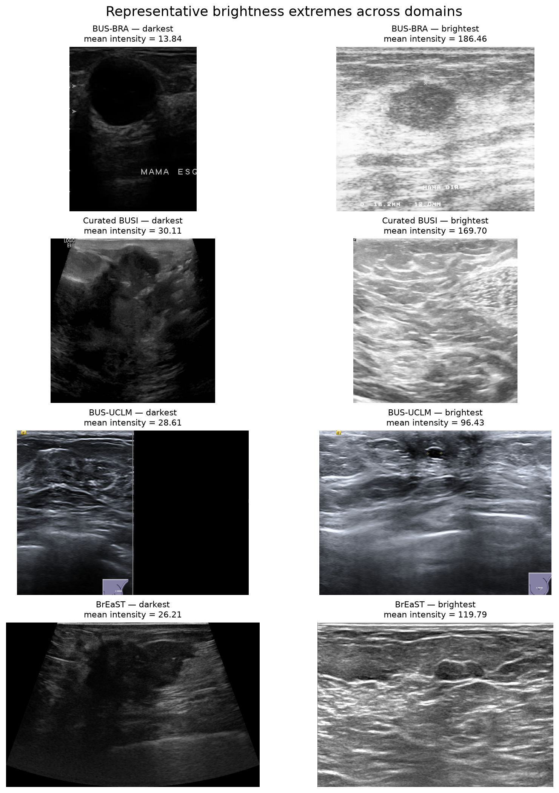
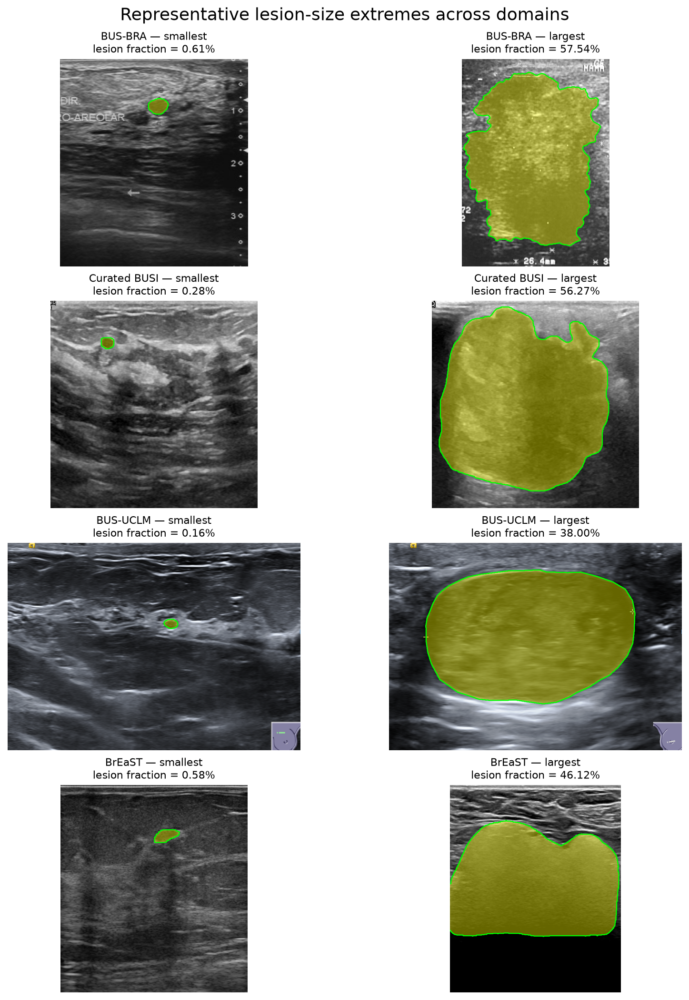
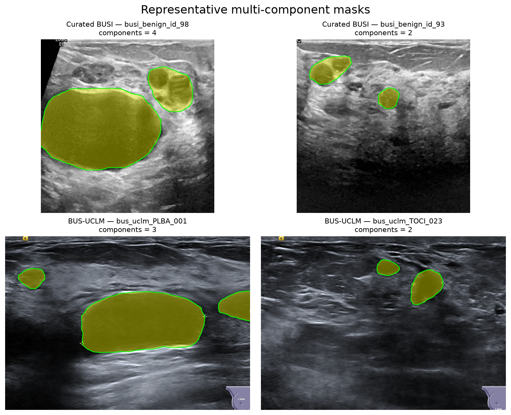

# Cross-domain EDA

This report summarizes the first comparison of the four ultrasound domains in the current manifest. The analysis covers dataset composition, patient structure, image properties, and lesion-mask characteristics.

| Source domain | Images | Patients | Lesion images |
|---|---:|---:|---:|
| BrEaST | 256 | 256 | 252 (98.4%) |
| BUS-BRA | 1,875 | 1,064 | 1,875 (100%) |
| BUS-UCLM | 670 | 37 | 260 (38.8%) |
| Curated BUSI | 450 | unavailable | 386 (85.8%) |

## Image characteristics

| Source domain | Median resolution (W x H) | Median aspect ratio | Unique resolutions | Mean brightness | Mean contrast | Mean p01–p99 range |
|---|---:|---:|---:|---:|---:|---:|
| BrEaST | 545 x 537 | 1.047 | 52 | 66.69 | 34.69 | 156.91 |
| BUS-BRA | 286 x 383 | 0.764 | 713 | 83.10 | 39.62 | 163.09 |
| BUS-UCLM | 856 x 606 | 1.413 | 1 | 63.96 | 38.39 | 171.94 |
| Curated BUSI | 512 x 512 | 1.000 | 1 | 83.07 | 51.48 | 199.54 |

Image geometry is strongly domain-specific. BUS-UCLM and Curated BUSI have one fixed resolution, whereas BUS-BRA contains 713 resolutions. A typical BUS-BRA image is portrait-oriented, BUS-UCLM is landscape-oriented, and Curated BUSI is square. BrEaST is close to square at the median but has a wide aspect-ratio range of approximately 0.66 to 3.22.

Brightness differs moderately between domains. BUS-UCLM and BrEaST are darker on average than BUS-BRA and Curated BUSI, although the per-image distributions overlap. BUS-BRA has the largest within-domain brightness variation.

The contrast difference is clearer. Curated BUSI has the highest mean contrast at 51.48, compared with 34.69 for BrEaST. BUS-BRA and BUS-UCLM have similar intermediate values. Curated BUSI also has the widest robust within-image intensity range, measured between its first and 99th intensity percentiles.

These results indicate that **resolution, aspect ratio, brightness, and contrast can all act as domain cues**. Resize and padding rules should therefore be chosen carefully, and training should use consistent intensity normalization.

### Color and Doppler

BUS-BRA and Curated BUSI are stored as single-channel grayscale images. BrEaST is stored as RGBA and BUS-UCLM as RGB, but the file mode alone does not prove that clinically meaningful color is present.

BUS-UCLM is the only current domain with an explicit Doppler label in its metadata. It contains 35 Doppler images out of 670, giving a Doppler prevalence of 5.22%. The remaining 635 images (94.78%) are labelled as non-Doppler. Doppler metadata is unavailable for the other three domains.

To screen for color automatically, the analysis searches for sufficiently bright pixels whose RGB channels differ clearly, while ignoring weak tint and dark pixels. Images containing a noticeable proportion of these pixels are flagged for review.

The color heuristic was compared with these labels to determine whether strongly colored pixels could identify Doppler automatically:

| BUS-UCLM metadata | Not flagged by heuristic | Flagged by heuristic |
|---|---:|---:|
| Non-Doppler | 632 | 3 |
| Doppler | 28 | 7 |

The strong-color pixel fraction is substantially higher in Doppler images than in non-Doppler scans: its mean is 0.81% versus 0.14%, and its median is 0.35% versus 0.12%. However, only seven of the 35 Doppler images exceed the conservative 1% threshold. The heuristic therefore reaches 70% precision but only 20% recall and misses 28 Doppler images. This shows that Doppler signal often occupies only a small part of the image. The metric is useful for characterizing color content, but not as a standalone Doppler detector or prevalence estimate.

False positives can be caused by colored scanner logos, orientation markers, text, and other overlays. False negatives occur when the Doppler region is small, faint, dark, or affected by compression and does not occupy enough of the full image. The metric can still prioritize candidates for visual inspection, but the metadata-derived value of 5.22% is the appropriate prevalence estimate for BUS-UCLM.

The current training loader converts every image to grayscale. Consequently, the model does not receive the original Doppler color channels, although colored regions can still produce distinctive grayscale intensities. This preprocessing decision should remain explicit and consistent across experiments.

## Lesion-mask characteristics

The table below includes only samples with a non-empty lesion mask.

| Source domain | Lesion masks | Median lesion fraction | Lesion fraction IQR | Median bbox fraction | Multi-component masks |
|---|---:|---:|---:|---:|---:|
| BrEaST | 252 | 4.90% | 2.30–9.07% | 6.67% | 0% |
| BUS-BRA | 1,875 | 6.22% | 3.30–11.81% | 9.21% | 0% |
| BUS-UCLM | 260 | 5.13% | 2.27–10.07% | 6.95% | 6.15% |
| Curated BUSI | 386 | 6.64% | 2.47–15.74% | 10.31% | 5.70% |

Median lesion size is relatively similar across domains: the lesion occupies approximately 4.9–6.6% of the image. The upper part of the distribution differs more. The third quartile is 15.74% in Curated BUSI, compared with 9.07% in BrEaST, indicating that Curated BUSI contains more large lesions or greater lesion-size variability.

The bounding-box statistics support the same conclusion. Curated BUSI has the largest median bounding-box fraction, followed by BUS-BRA.

Most masks contain exactly one connected lesion component. Multiple components occur in approximately 6% of BUS-UCLM and Curated BUSI masks, but not in BUS-BRA or BrEaST. These cases should be inspected before deciding whether they represent multiple lesions, fragmented annotations, or mask artifacts.

## Patient and class structure

Patient structure differs substantially between domains:

| Source domain | Images per patient | Patients with multiple images |
|---|---:|---:|
| BrEaST | always 1 | 0 of 256 |
| BUS-BRA | 1–2, median 2 | 811 of 1,064 |
| BUS-UCLM | 3–39, median 17 | 37 of 37 |
| Curated BUSI | unavailable | unavailable |

BUS-UCLM has only 37 patients but 670 images. Its samples are therefore highly dependent, and a sample-level split would cause serious patient leakage. Image-level evaluation can also overweight patients with many scans, because a patient contributing 39 images has substantially more influence on the aggregate metric than a patient contributing three images.

Curated BUSI has no patient identifiers, so patient-level independence cannot currently be verified.

The image-level diagnosis distribution is also domain-specific:

| Source domain | Normal | Benign | Malignant |
|---|---:|---:|---:|
| BrEaST | 1.6% | 60.2% | 38.3% |
| BUS-BRA | 0% | 67.6% | 32.4% |
| BUS-UCLM | 61.2% | 25.4% | 13.4% |
| Curated BUSI | 14.2% | 49.3% | 36.4% |

BUS-BRA contains no normal samples, whereas normal images form the majority of BUS-UCLM. Class composition can therefore become another shortcut for recognizing the source domain.

Under the initial development protocol, BUS-BRA and Curated BUSI together contain only 64 normal images out of 2,325 samples (approximately 2.8%), whereas normal scans account for 61.2% of BUS-UCLM. This creates a substantial lesion-prevalence shift and may lead to increased false-positive segmentation on the unseen BUS-UCLM domain. Evaluation should therefore report performance on normal scans separately rather than relying only on lesion-case Dice scores.

Patient-level diagnosis counts require special care. In BUS-UCLM, 32 of 37 patients occur under more than one diagnosis across their scans. Counts of normal, benign, and malignant patients consequently overlap and must not be added together as if they were disjoint groups.

## Visualization findings

Four initial figures are generated in `outputs/eda/figures/` by `run_eda.py`.

The normalized diagnosis chart makes the class-composition shift immediately visible. BUS-UCLM is dominated by normal scans, BUS-BRA contains no normal scans, and the two remaining datasets have different normal-to-lesion proportions. Reporting only raw counts would hide this difference because the domain sizes are highly unequal.

The patient-structure plot confirms three distinct sampling regimes. BrEaST has one image per patient, BUS-BRA has one or two, and BUS-UCLM has between three and 39. The logarithmic axis keeps all three regimes readable. Curated BUSI is explicitly marked as unavailable because its patient identifiers are missing.

The lesion-fraction distributions are right-skewed and overlap substantially around their central values. Domain differences are more apparent in the upper tails than in the medians. Curated BUSI has the broadest upper distribution, while BUS-UCLM has the lowest observed maximum. This supports treating lesion scale as a moderate domain shift rather than the dominant difference between the datasets.

The brightness plot shows considerable overlap between domains, with BUS-BRA displaying the widest variation. BUS-UCLM is the most tightly concentrated and, together with BrEaST, is darker than BUS-BRA and Curated BUSI. The contrast plot separates Curated BUSI more clearly: its median contrast is 52.31, compared with 38.70 for BUS-BRA, 37.94 for BUS-UCLM, and 33.27 for BrEaST.

## Qualitative manual inspection

To complement the quantitative EDA, representative samples from the extremes of the brightness and lesion-size distributions, together with multi-component masks, were reviewed alongside their decoded masks and segmentation overlays.

Whole-image brightness reflects both ultrasound tissue appearance and dataset-specific image composition. Black backgrounds, field-of-view geometry, scanner-export layout, embedded text, measurement scales, and other overlays all affect the statistic. BUS-BRA contains heterogeneous layouts with frequent text and measurement annotations. BUS-UCLM has a fixed 856 x 606 presentation with recurring corner graphics and measurement markers, as well as occasional Color Doppler. Curated BUSI has a fixed square presentation, whereas BrEaST has heterogeneous field-of-view and border geometry.

*Figure 1. Representative brightness extremes across domains. Whole-image intensity differences reflect both tissue appearance and dataset-specific image composition, including black backgrounds, field-of-view geometry, and scanner overlays.*

**Non-anatomical scanner-export characteristics appear to be among the easiest features by which the domains can be distinguished visually.** They can therefore act as strong domain shortcuts: a model may learn to recognize the dataset without relying on clinically meaningful lesion appearance.

The reviewed smallest and largest lesion cases were visually plausible across all four datasets, and their masks were aligned with the corresponding image structures. This suggests that the tails of the lesion-size distributions are not primarily caused by mask-decoding or image-mask pairing errors. Very large lesions can occupy a substantial part of the field of view and sometimes approach the image boundary. Aggressive cropping could consequently remove part of the target or substantially change its apparent size. An aspect-ratio-preserving resize with padding is therefore a safer initial preprocessing strategy.

*Figure 2. Smallest and largest non-empty masks in each domain. The reviewed distribution tails are visually plausible and spatially aligned. The large Curated BUSI example confirms that its heavy upper lesion-size tail is not simply an annotation artifact; several large targets also approach the image boundary.*

Multi-component masks in BUS-UCLM and Curated BUSI were also confirmed as genuine annotation patterns rather than decoding artifacts. Some contain clearly separated annotated structures, while others contain a dominant region with smaller satellite or fragmented regions. `component_count` should therefore be interpreted as a descriptor of mask topology, not automatically as the number of clinically distinct lesions.

*Figure 3. Representative multi-component masks from Curated BUSI and BUS-UCLM. The disconnected regions correspond to plausible annotation patterns rather than mask-decoding errors. A component count greater than one does not by itself establish the presence of multiple clinically distinct lesions.*

No systematic image-mask misalignment was observed among the reviewed extreme cases. Overall, the qualitative review shows that domain shift is visible not only in pixel-intensity statistics but also in scanner layout, field of view, borders, annotations, and acquisition presentation. This motivates a central follow-up question: can domain-generalization methods prevent the learned representation from relying on scanner- and dataset-specific shortcuts?

The full inspection grids remain in `outputs/eda/manual_checks/` as local evidence and debugging material; the report keeps only the three compact comparisons above. `run_eda.py` regenerates both sets of figures. All reproduced ultrasound images remain subject to their source datasets' licences and citation requirements and are not covered by the repository's software licence; see the [dataset documentation](../../DATASETS.md).

## Overall conclusion

The domains differ at several levels, but the strongest observed shifts are not lesion geometry alone:

1. image geometry is highly domain-specific, ranging from fixed square images to hundreds of resolutions and strongly different aspect ratios;
2. patient sampling and diagnosis composition differ substantially and can become confounders or sources of leakage;
3. acquisition appearance differs through brightness, contrast, intensity range, overlays, tint, and occasional Color Doppler;
4. lesion-size distributions overlap, although Curated BUSI contains a heavier upper tail and BUSI and BUS-UCLM contain a small fraction of multi-component masks.

Patient-level splitting is mandatory wherever patient identifiers are available. Preprocessing should preserve anatomy while standardizing input size, and intensity augmentation should cover the observed brightness and contrast variation. Dataset identity may otherwise be learned from geometry, class composition, scanner appearance, or sampling structure instead of clinically relevant lesion features.

## Notes

Brightness and contrast are calculated over the full image. Black backgrounds, borders, text, measurement marks, and scanner overlays can therefore affect the results. These statistics are descriptive and do not test statistical significance.

Thirteen BUS-UCLM images belonging to patient `HESN` are absent from the manifest because their image dimensions do not match their masks or the resolution declared in the metadata.

The tables are generated from `outputs/eda/manifest_summary.csv`, `outputs/eda/image_stats_summary.csv`, and `outputs/eda/mask_stats_summary.csv`.
