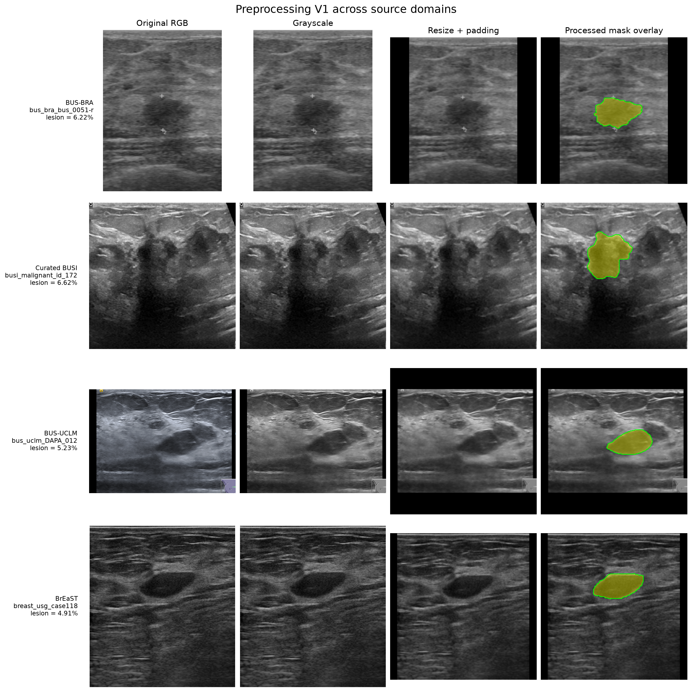

# Preprocessing V1

The initial preprocessing pipeline follows directly from the differences identified in the [cross-domain EDA](../eda/image-domain-statistics.md). In particular, the datasets have strongly different image dimensions and aspect ratios, and some large lesions approach image boundaries. V1 therefore avoids cropping and geometric stretching.

For every sample, the pipeline:

1. composites transparent image regions onto a black background;
2. converts the image to grayscale;
3. resizes the image and mask while preserving their aspect ratio;
4. applies symmetric zero padding to obtain a 256 x 256 input;
5. scales image intensities from `[0, 255]` to `[0, 1]`;
6. replicates the grayscale image into three input channels;
7. applies channel-wise ImageNet normalization for the pretrained ResNet34 encoder.

The resulting model input has shape `3 x 256 x 256`. The image uses bilinear interpolation, while the mask uses nearest-neighbor interpolation so that its labels remain discrete. Masks are kept binary, have shape `1 x 256 x 256`, and are not divided by 255.

ImageNet normalization is used for compatibility with the pretrained ResNet34 encoder, not because the ImageNet channel statistics are assumed to characterize breast ultrasound data. The grayscale image is replicated across three channels solely to match the encoder input expected by its pretrained weights.

## Visual check

The figure below shows one representative lesion sample from each domain. Each row contains the original image, its grayscale representation, the resized and padded model input, and the processed mask overlaid on that input. The normalized model tensor is converted back to display intensities only for this visualization; training continues to use the ImageNet-normalized values.

*Figure 1. Preprocessing V1 applied to representative samples from all four domains. Aspect ratio is preserved, padding is added only along the shorter spatial dimension, and masks remain aligned with the corresponding image structures. ImageNet normalization is reversed only for display.*

The check confirms that the same spatial transformation is applied consistently across domains without visibly stretching the anatomy. The processed masks remain aligned with the lesions, including after padding. Black padding is intentionally used as the initial baseline because it matches the background already present in many ultrasound exports.

This is a deliberately conservative baseline. More aggressive intensity and geometric augmentations will be evaluated only after baseline segmentation performance has been established, so their effect can be measured separately.

The pipeline is configured in `src/ultrasound_dg/configs/preprocessing/v1.yaml` and implemented in `src/ultrasound_dg/data/preprocessing.py`. The visual comparison is regenerated by `src/ultrasound_dg/scripts/run_eda.py` using the same preprocessing class as the training dataset.
